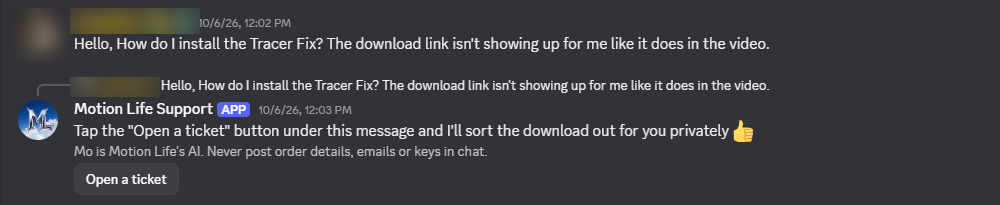
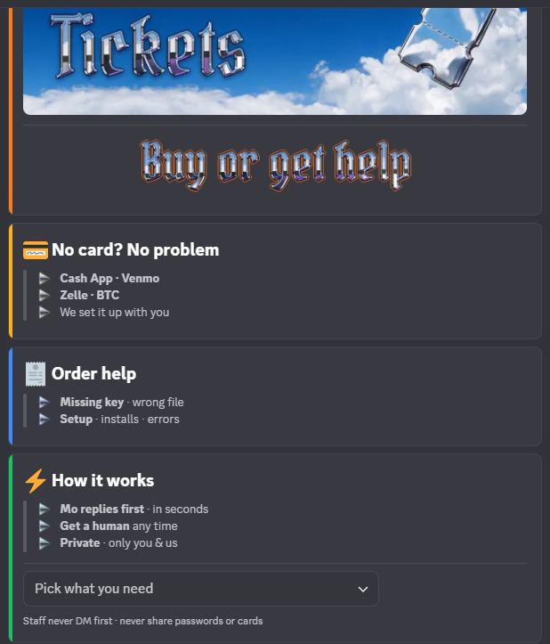

# Motion Life Support: Message Content in use

Real screenshots from the Motion Life Discord server (member names and avatars blurred).
Privacy policy: [scarebk.github.io/motionlife-privacy](https://scarebk.github.io/motionlife-privacy/)

## 1. A member asks a plain-text question in chat, Mo reads it and answers

A member typed a normal question (no command, no mention of the bot) in the public chat channel.
Mo needs the message text to understand it's an order/download problem and point them to a private ticket.

## 2. The ticket panel members use to open a private ticket

Inside the ticket, members describe their problem in their own words (often new PC players who don't know
slash commands). Mo reads those messages to answer setup questions and check orders. Keys, emails and order
numbers are masked before anything is stored, and closed tickets are deleted.

## 3. Moderation

In public channels Mo checks message text for spam bursts and hacked-account scam posts ("check my bio"
lures). Those are deleted, the sender gets a timeout (10 minutes for spam, 24 hours for scam posts), and the server owner gets an alert with a
"Not spam, unmute" button. Public chat text is not stored; the check only holds the last 15 minutes in memory.
